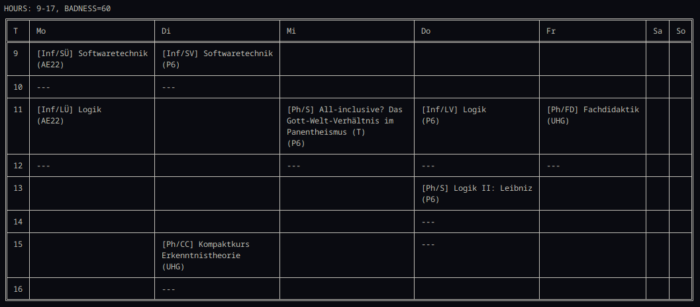

# Let's build a schedule!
Since I don't receive a ready-made schedule from my university and have to put it together myself in painstaking work (a catastrophe!), I have decided to build a program that creates my schedule for me. It evaluates the schedules based on certain criteria, for example, the time needed from one location to another, and provides the best possible schedule.

## Usage
You can find a usable JAR-file [here](https://github.com/survari/uni-scheduler/releases). Create a CSV file, let's call it `timetable.csv`. It will contain all the possible courses you can take.

Here is an example: Let's say you study to become a teacher for computer science and philosophy and you want to create the timetable for your third semester. But because the logic courses in philsophy and computer science overlap in the first semester, you now have to take _Theoretical Philosophy 1_, _Teaching Philosohy_, _Software Engineering_, and _Logic_.

### 1. Courses
The course catalog shows all the modules that you can attend to, so look them up. After you collected your possible courses, put them into the CSV-file like this:

```csv
COURSE,<type>,<name>,<day>,<starts>,<ends>,<location>
```

- `type`: you can specify later how many courses of this type should be added to your schedule. If you have to attend to 3 seminars and 6 seminars are provided, put all of the 6 into one category.
- `name`: name of the course
- `day`: German 2-letter name of the day of the week
- `starts`: hour it starts in 24-hour format (1,2,3,4,...,21,22,23,24)
- `ends`: hour the course ends
- `location`: shortcut of the location, more on this later

```csv
COURSE,A,[Ph/CC] Kompaktkurs Sprachphilosophie,Mo,13,15,U69
COURSE,A,[Ph/CC] Kompaktkurs Erkenntnistheorie,Di,15,17,UHG

COURSE,B,[Ph/S] Logik II: Leibniz,Do,13,16,P6
COURSE,B,[Ph/S] Kant: Kritik der reinen Vernunft,Mo,19,21,ABT
COURSE,B,[Ph/S] Kritische Theorie,Di,13,15,ABT
COURSE,B,[Ph/S] Max Stirner: Der Einzige und sein Eigentum,Di,11,13,ABT
COURSE,B,[Ph/S] All-inclusive? Das Gott-Welt-Verhältnis im Panentheismus (T),Mi,11,13,P6

COURSE,C,[Ph/FD] Fachdidaktik,Fr,11,13,UHG
COURSE,C,[Ph/FD] Fachdidaktik,Mo,11,13,UHG

COURSE,D,[Inf/SV] Softwaretechnik,Di,9,11,P6

COURSE,E,[Inf/SÜ] Softwaretechnik,Di,11,13,AE22
COURSE,E,[Inf/SÜ] Softwaretechnik,Mo,9,11,AE22
COURSE,E,[Inf/SÜ] Softwaretechnik,Do,15,17,AE22
COURSE,E,[Inf/SÜ] Softwaretechnik,Fr,13,15,AE22

COURSE,F,[Inf/LV] Logik,Do,11,13,P6
COURSE,F,[Inf/LV] Logik,Fr,9,11,P6

COURSE,G,[Inf/LÜ] Logik,Mi,7,9,AE22
COURSE,G,[Inf/LÜ] Logik,Di,15,17,AE22
COURSE,G,[Inf/LÜ] Logik,Di,17,19,AE22
COURSE,G,[Inf/LÜ] Logik,Mo,11,13,AE22
```

### 2. Locations
Define how long you need from one location to another. Here we have:
- UHG = Universitätsplatz 1
- P6 = Parkstraße 6
- AE22 = Albert-Einstein-Str. 22
- ABT = August-Bebel-Str. 28
- U69 = Ulmenstraße 69

The syntax is:
```csv
LOC,<nameA>,<nameB>,<time>
```

The time can be optimistic, or pessimistic. How long you need from `nameA` to `nameB` can vary, so maybe being pessimistic is not that bad.

```csv
LOC,UHG,ABT,10
LOC,AE22,UHG,35
LOC,AE22,ABT,35
LOC,U69,ABT,25
LOC,U69,AE22,20
LOC,U69,UHG,25
LOC,P6,U69,5
LOC,P6,UHG,20
LOC,P6,ABT,25
LOC,P6,AE22,20
```

### 3. Obligations

Now define what courses you have to take:
```csv
```

According to our study regulation, we'd have to take 1×Ph/CC, 2×Ph/S, 1×Ph/FD, 1×Inf/SV, 1×Inf/SÜ, 1×Inf/LV, 1×Inf/LÜ:

```csv
CHOOSE,A,1
CHOOSE,B,2
CHOOSE,C,1
CHOOSE,D,1
CHOOSE,E,1
CHOOSE,F,1
CHOOSE,G,1
```

### Generate the timetable

Collecting the data is time consuming, but more efficient than putting the timetable together by yourself. After everything, run the program and use `timetable.csv` as the first argument:

```
java -jar scheduler.java timetable.csv
```



This is the best possible timetable for the courses, the program prints the top 10, the smaller the badness-score the better.